# 🗂️ Task Manager CLI (C++)

A **console-based Task Management application** built using **C++** that demonstrates the practical implementation of **core data structures** such as **Doubly Linked List, Stack, Queue**, combined with **file handling**, **multithreading**, and **focus productivity features**.

> 📌 **Author:** Dzacky Ahmad
> 🎓 Informatics Engineering Undergraduate
> 📚 Final Project – Data Structures & Algorithms

---

## ✨ Features Overview

* ➕ Add tasks with priority, category, and deadline
* 📂 View tasks (all, today’s deadline, completed)
* 🛠️ Manage tasks (edit, delete, redo, pin/unpin)
* 📊 Statistics & filtering (by name, deadline, category, entry order)
* 🧘 Focus Mode (timer + background music)
* 🔔 Deadline reminder (today & tomorrow)
* 🕓 Activity logging (history tracking)
* 💾 Persistent storage (save & load from file)
* 🎯 Random motivational quotes on startup

---

## 🧠 Data Structures Used

| Structure          | Purpose                               |
| ------------------ | ------------------------------------- |
| Doubly Linked List | Main task storage & ordered traversal |
| Stack              | Redo deleted tasks & completed tasks  |
| Queue              | Track task entry order                |
| File Handling      | Save/load tasks & activity logs       |
| Multithreading     | Focus mode timer & user interruption  |

---

## 🖥️ Application Preview

### 1️⃣ Main Menu

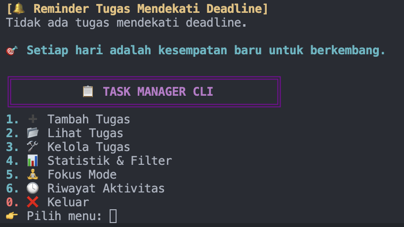

### 2️⃣ Add Task

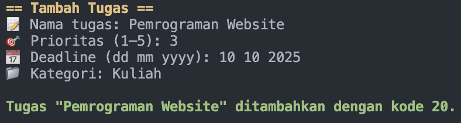

### 3️⃣ View Tasks

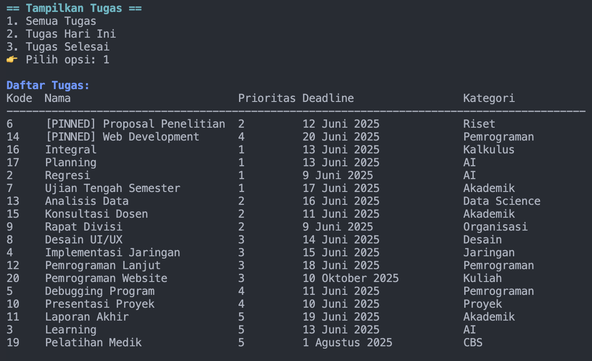

### 4️⃣ Manage Tasks

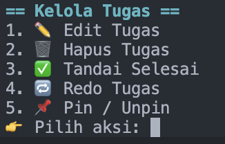

### 5️⃣ Delete Task

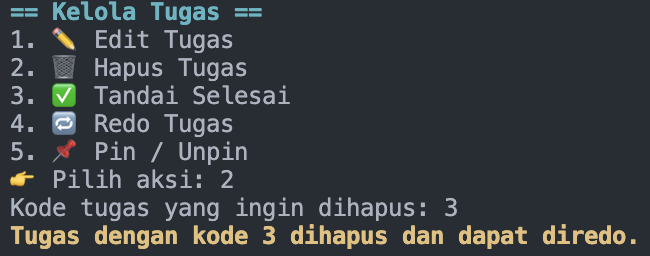

### 6️⃣ Edit Task

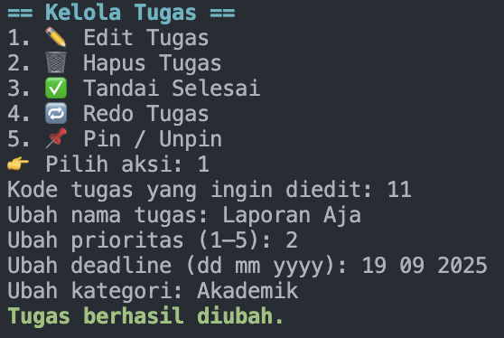

### 7️⃣ Edit Status / Finish Task

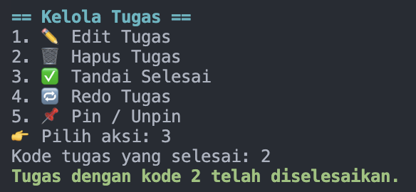

### 8️⃣ Redo Task

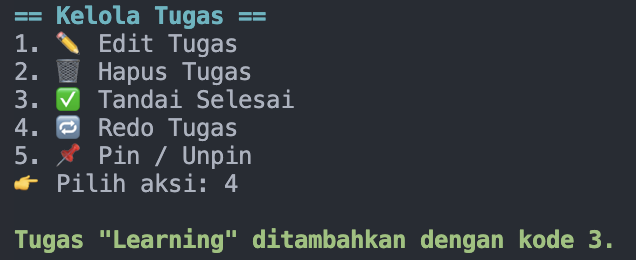

### 9️⃣ Pin / Unpin Task

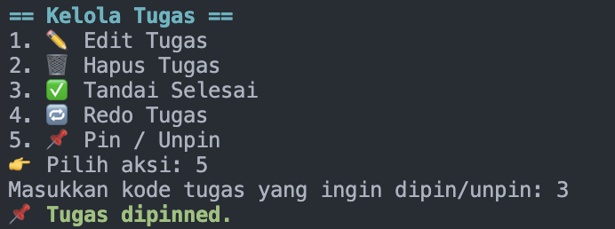

### 🔟 Statistics & Filter

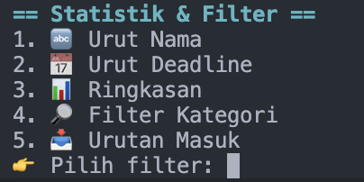

### 1️⃣1️⃣ Sort by Name

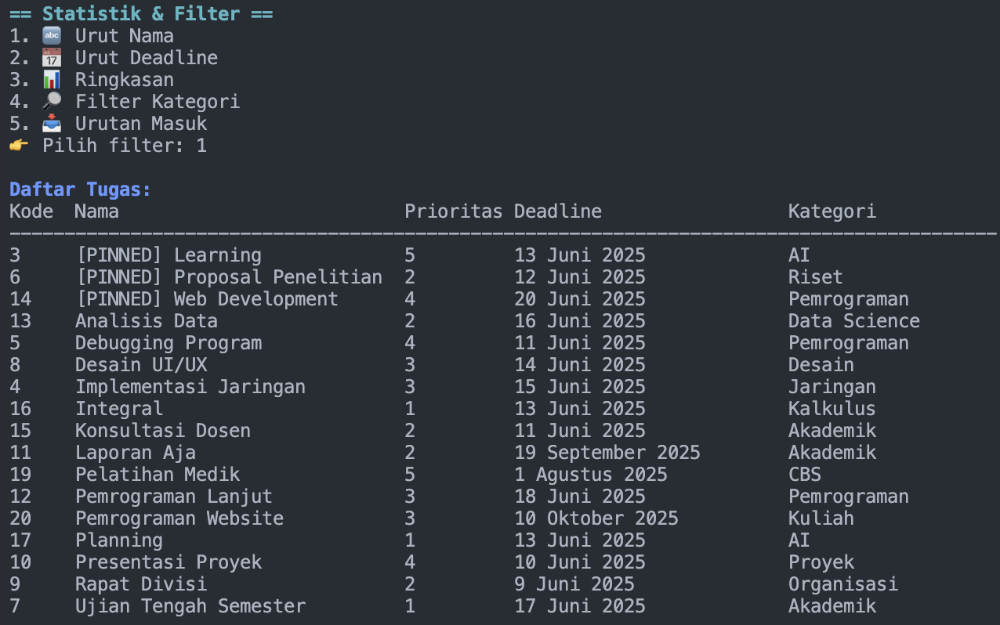

### 1️⃣2️⃣ Sort by Deadline

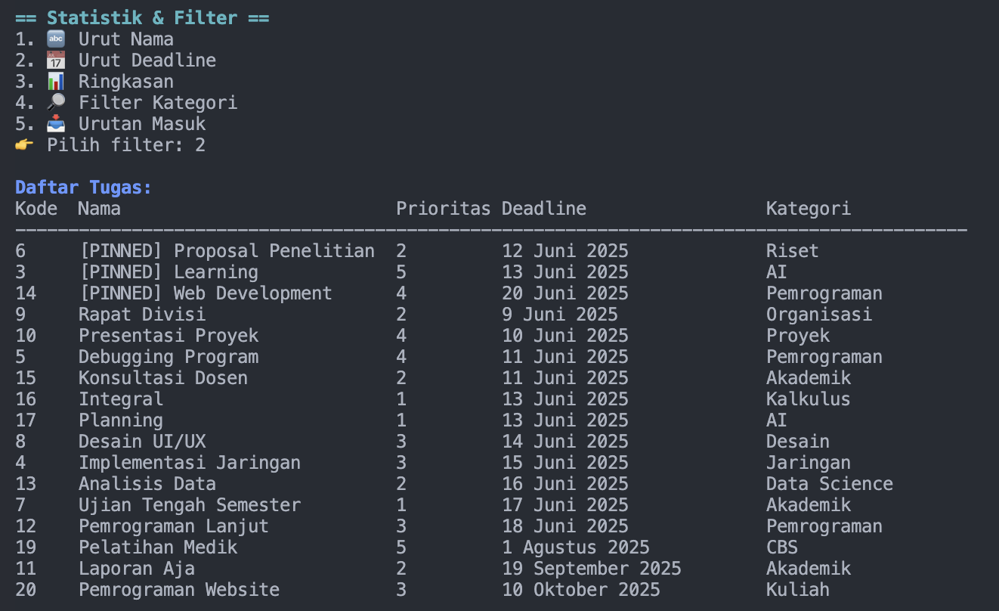

### 1️⃣3️⃣ Summary Dashboard

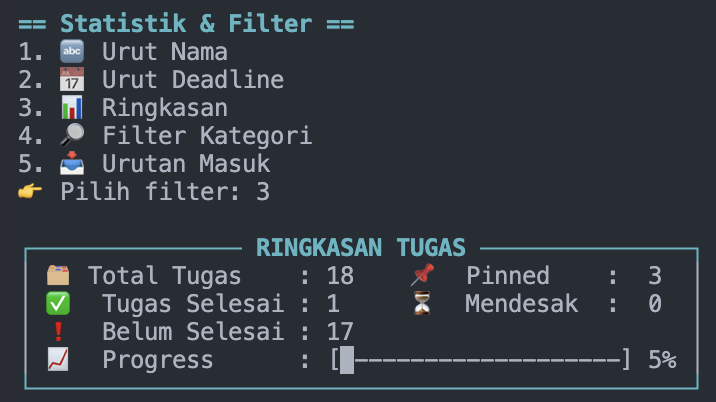

### 1️⃣4️⃣ Filter by Category

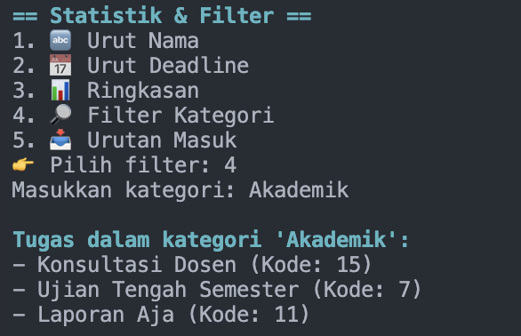

### 1️⃣5️⃣ Entry Order (Queue)

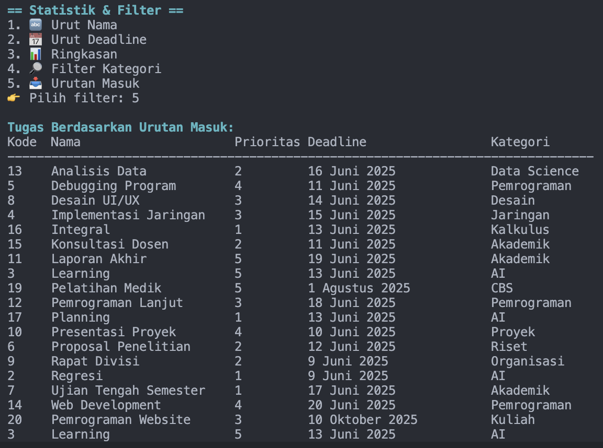

### 1️⃣6️⃣ Focus Mode

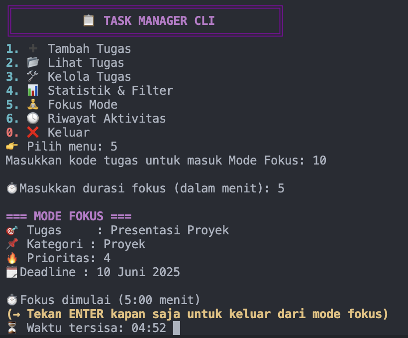

### 1️⃣7️⃣ Activity History

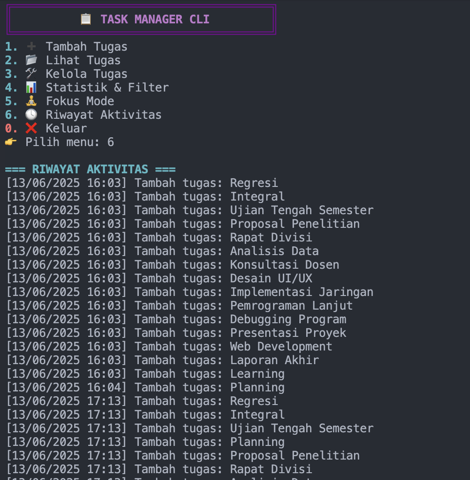

### 1️⃣8️⃣ Exit Program

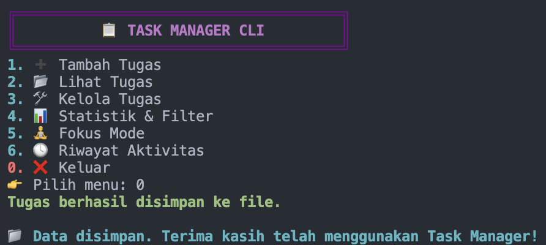

---

## 📁 Project Structure

```bash
UAS-STRUKDAT-A-TUGASBESAR
├── data/               # Task data & activity logs
├── img/                # Application screenshots
├── music/              # Focus mode background music
├── task_manager.hpp    # Header (structures & declarations)
├── task_manager.cpp    # Core implementation
├── main.cpp             # Program entry point
└── README.md
```

---

## 🚀 How to Run

```bash
g++ main.cpp task_manager.cpp -o task_manager
./task_manager
```

> ⚠️ **Note:** Focus mode music requires macOS (`afplay`). Adjust command for other OS if needed.

---

## 🎯 Learning Outcomes

* Strong understanding of **manual memory management**
* Practical use of **classic data structures**
* Experience with **CLI UX design**
* Implementing **multithreading & concurrency**
* Clean modular code using header files

---

## 📌 Portfolio Note

This project was **fully developed individually** by **Dzacky Ahmad** as part of a **Data Structures & Algorithms** course, demonstrating problem-solving skills, system design thinking, and clean C++ implementation.

---

## 🔗 Author

* **Dzacky Ahmad**
* Informatics Engineering Undergraduate
* 📧 [dzackyahmad.career@gmail.com](mailto:dzackyahmad.career@gmail.com)

---

⭐ If you find this project interesting, feel free to give it a star!
